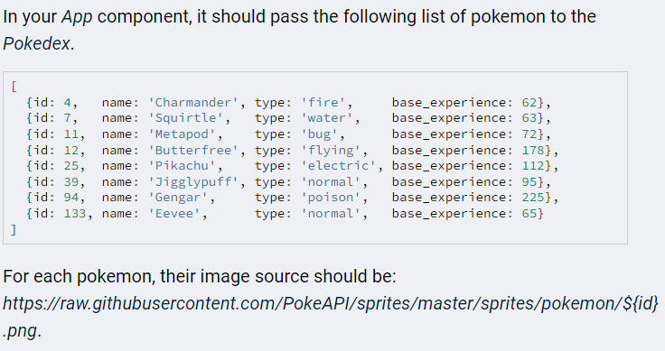

# React Pokedex
With this app, I practiced creating React components and passing/accessing props by creating two "Pokedexes". Each one is generated randomly from a set of Pokemon, and each Pokemon has base experience points. The "Pokedex" with the higher total experience "wins." Refresh the page to generate a new set of Pokedexes.

     

## Running the App
1) Clone repo: `git clone https://github.com/mpike91/React-Pokedex.git`
2) Move into directory: `cd React-Pokedex/`
3) Install npm: `npm install`
4) Start app: `npm start`

## My Contribution
I was not given any starter code for this app. I used create-react-app to generate the boilerplate code, and I was given an array of Pokemon objects to work with:

     

